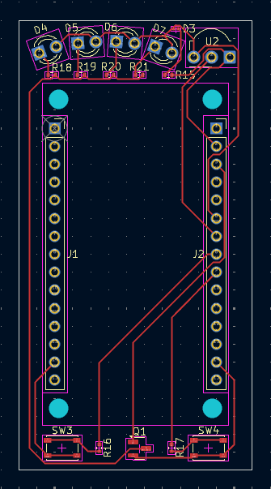

### Total time: Around Twenty hours

### 19/6/2025 | Four hours spent
I started by searching for a tutorial/example of a custom esp board, as at the start I wanted to make a full microcontroller that has the esp-remote's features.

As I wasn't able to find a good example, I went to the NodeMcu's [repo](https://github.com/nodemcu/nodemcu-devkit-v1.0) and took a look at the schematics there.

Now, I downloaded kicad and kicad wakatime, as this is my first time designing a pcb. The wakatime was a bit troublesome, and the kicad autosave didn't work.
So throughout the project a heartbeat was sent only when I saved the project (which I forgot to do often), and sometimes the wakatime completely crashed, and it took me a while to notice.

After finishing the setup, I started making the schematic, using the parts from the NodeMcu. I used this stage to get to know and get comfortable with the kicad schematic editor.

After that, I started assigning footprints to all the components. This process was pretty annoying, as it was mainly searching in Google for a fitting component model, and hoping that kicad would have it.

### 20/6/2025 | Two and a half hours spent
I started the day by looking again for existing schematic files, as I was very unsure about the work I've done. These searches failed.

Now, I want to start adding my custom additions to the board. I started by adding the IR receiver module, then continued to add an LED attached to it, an IR LED (transmitter), and two action buttons for sending set messages. I've also connected all of these to the rest of the board through the GPIO's.

I Had some trouble adding the LED that's attached to the IR receiver's output line, as the output is pulled up.
I made an inverter to power the LED's transistor. 
However, at the end I realized that commercial boards that use the receiver have the exact same thing, and that all that's needed is to connect the LED to the output and to high (through a resistor, of course).

I have also had some trouble getting the resistor's value right, but I found a LED calculator that helped me with that.

### 22/6/2025 | Three hours spent
After I finished the schematic, I went over to start the placement. I was close to done with the placement when I realized my plans won't work for two reasons:

1. As this was my first time doing such a thing, I didn't have the knowledge nor the ability to route this whole thing.

2. There is no way I will be able to hand solder these SMT components, and an assembly service would probably be more expensive than just buying an esp8266.

So, this is where I pivoted into making a Hat for the esp, which will be way more achievable and also cheaper.
I ended the day by searching for an esp8266 footprint, which I didn't find.

### 23/6/2025 | Around five hours spent
I started off by creating a precise esp8266 footprint. I used an existing kicad footprint of an 15*1 connector, measured an esp, and this way created a footprint.

Using the precise measurement in kicad proved very difficult, and I had to play with it alot to get it to do what I wanted.

Next, I replaced all the components of an esp that where in my schematic, with the new footprint and symbol I have just created.

Now, I got to the fun part, placing all the components on the pcb (way easier this time) and routing the traces.
After a bit of moving stuff around, I decided to add a few more IR LEDs, as I have experienced strength problems with them in my breadboard prototype.

At the end I managed to route the whole pcb in one layer and had a pcb that I was very happy with.
a

### 28/6/2025 | Four and a half hours spent
After pretty much finishing the pcb design, I went over to try and load it into jlcpcb.
I had to finagle with the BOM and POS files a bit for jlcpcb to accept them, but it worked out at the end.

While looking at the BOM I realized I might have gotten the IR receiver wrong, and in the end I settled with the TSOP34838.
I placed the new one on the pcb, and loaded the files to jlcpcb again.

Me looking for IR receivers:

