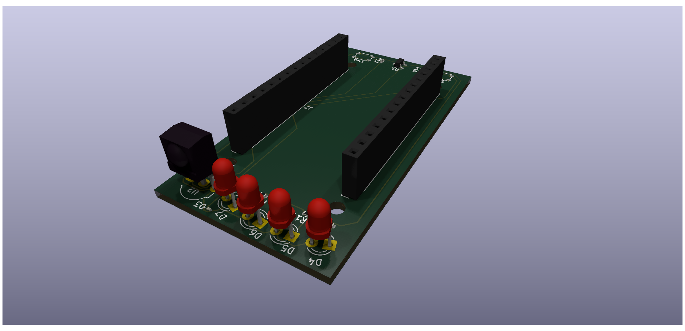
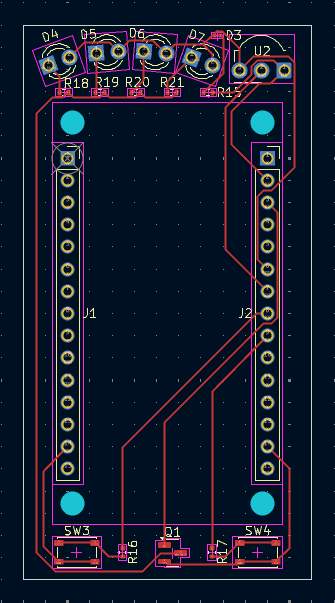

# esp-remote-board
This is a custom board for my [esp-remote](https://github.com/orgaPumpkin/esp-remote-project) project (check it out).

It is a Hat for the esp8266, which contains an IR receiver, an IR emitter, and two buttons to send set messages.

I made this board in order to make this project more accessible, as putting the esp8266 into the Hat is way easier than connecting the components to a breadboard.
Additionally, a Hat is way more compact and clean than a breadboard and gives the project the filling of a final product.

| Component             | Designator                        | LCSC Part Number | Link                                                            |
|-----------------------|-----------------------------------|------------------|-----------------------------------------------------------------|
| TSOP34838             | U2                                | C44620           | https://jlcpcb.com/partdetail/VishayIntertech-TSOP34838/C44620  |
| PTS810                | SW3, SW4                          | C221895          | https://jlcpcb.com/partdetail/CK-PTS810SJG250SMTRLFS/C221895    |
| 470 Ohm 0402 resistor | R15, R16, R17, R18, R19, R20, R21 | C23179           | https://jlcpcb.com/partdetail/23906-0603WAF4700T5E/C23179       |
| SS8050                | Q1                                | C2150            | https://jlcpcb.com/partdetail/2507-SS8050_RANGE_200_350/C2150   |
| 1x15 2.54 Socket      | J1, J2                            | C7499333         | https://jlcpcb.com/partdetail/Megastar-ZX_PM2_54_115PY/C7499333 |
| 3.0mm THT IR LED      | D4, D5, D6, D7                    | C7470790         | https://jlcpcb.com/partdetail/TONYU-DY_IR204TE12/C7470790       |
| 0603 red LED          | D3                                | C2286            | https://jlcpcb.com/partdetail/Hubei_KENTOElec-KT0603R/C2286     |
